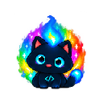

  

<h1 align="center">Diego Giron · Marleo</h1>
<h1 align="center">Marleo</h1>

<strong>Full Stack Developer · UI/UX · Automation · QA</strong>

<em>Code · Explore · Create · Together</em>

  
  
  

## What I build

I turn concrete ideas into useful web products: clear interfaces, reliable backend logic, integrations and the QA needed to ship with confidence.

<table><tr>
<td width="33%"><strong>Product interfaces</strong> Responsive UI, accessible flows and practical UX decisions.</td>
<td width="33%"><strong>Integrations</strong> APIs, automations, real-time communication and connected workflows.</td>
<td width="33%"><strong>Quality</strong> Testing my own work, reading logs and solving problems from the root.</td>
</tr></table>

## Selected work

| Project | What it explores | Status |
| --- | --- | --- |
| **Focus Monitor** | Operational monitoring and computer-vision workflows. | Private project · source not published |
| **Handy** | Home-services SaaS concept with requests and real-time conversations. | Demo · in development |
| **Fini** | Personal-finance experience focused on planning and useful data views. | Demo |
| **Recruitment Flow** | WhatsApp → n8n → ATS workflow concept. | Mockup |
| **Lashes by Fer** | Responsive service, portfolio and booking experience. | Client/demo site |

Some work projects are private. I share the product thinking and public demos without exposing company code, credentials or internal data.

## Stack I reach for

  

Cloudflare Workers · Socket.IO · REST APIs · n8n · Make · Zapier · Tailwind CSS

## How I work

**Understand → design → build → integrate → test.**

My background in technical support taught me to translate a person’s idea into a workable system, communicate trade-offs clearly and keep looking until the root cause makes sense.

## Experience

- **IT / Software Developer** — full-stack development, UI/UX and QA.
- **Technical Support Engineer** — workflows, automations, Jira/Salesforce integrations and JSON log analysis at monday.com.

## Let’s build something useful

Have an idea, a workflow that needs connecting or a product that needs a clearer interface?

<a href="mailto:diegoleonelgl@gmail.com?subject=Project%20idea">Start a conversation →</a>

En español

Desarrollo productos web, automatizaciones e integraciones desde la interfaz hasta el backend y las pruebas. Puedes conocer más en [leodevp.com](https://www.leodevp.com/).

